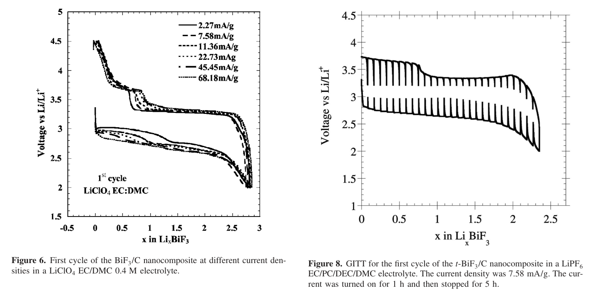

```{r setup, include=FALSE}
knitr::opts_chunk$set(echo = TRUE)
```

# Механистический анализ

## Определение

Механистический анализ - подход,
в большей степени связанный с фундаментальной наукой, исследованиями
и разработками, и к нему больше подходит термин «моделирование», чем
«анализ». Механистическое моделирование и анализ отличаются очень
глубоким пониманием системы, которое приходит в результате много-
летнего контролируемого изучения стабильной системы посредством
большого числа экспериментов.

## Отличительные черты
- Применяется к простым или хорошо моделируемым детерминированными уравнениями ситуациям
- Обычно применяется к физическим или инженерным наукам
- Часто единственный шум в данных - ошибки измерения

## Пример статьи

Investigation of the Lithiation and Delithiation Conversion Mechanisms of Bismuth Fluoride Nanocomposites - M. Bervas, A. N. Mansour, W.-S. Yoon, et al.

[DOI](https://doi.org/10.1149/1.2167951)

Целью данной работы является формирование модели, основанной на изменении механизмов электронного и ионного транспорта в зависимости от степени завершенности реакций превращения и обратного превращения в нанокомпозите $\mathrm{BiF}{_3}/\mathrm{C}$ при циклическом воздействии, что приводит к образованию $\mathrm{Bi}{^0}$ и $\mathrm{LiF}$ во время литирования и повторному образованию $\mathrm{BiF}{_3}$ во время делитирования.

## Обоснование


1.Целью исследования является не констатация факта, а подробное описание процессов, происходящих при реакции веществ:
$$
\mathrm{M}^{Ζ}+\mathrm{X}_\mathrm{y}+\mathrm{ΖLi} → \mathrm{M}^0+\mathrm{yLi}_{(Ζ/\mathrm{y})}\mathrm{X}
$$

2. В ходе работы подробно описываются все этапы исследуемого процесса.
3. Для доказательства роли каждого звена авторы используют методы, которые точечно нарушают или модулируют предполагаемый механизм, в частности изменение температуры реагентов во время реакции



# Дедуктивный анализ

## Определение

Дедуктивный анализ — подход, который позволяет делать прогнозы и выводы о популяции на основе выборочных данных. 
В отличие от описательного анализа, который только обобщает данные, дедуктивный анализ позволяет проверять гипотезы, 
делать оценки и измерять степень неопределенности прогнозов. 

## Отличительные черты
- Позволяет оценивать значение переменной для генеральной совокупности и указывает меру неопределенности в отношении полученной оценки
- Возможность точного вывода информации о большей популяции во многом зависит от схемы выборки

## Пример статьи

Prevalence and socio-demographic correlates of psychological health problems in Chinese adolescents during the outbreak of COVID-19 - Shuang-Jiang Zhou, Li-Gang Zhang, Lei-Lei Wang, et al.

[DOI](https://doi.org/10.1007/s00787-020-01541-4)

Целью данного исследования было оценить распространенность и социально-демографические корреляты депрессивных и тревожных симптомов среди китайских подростков, затронутых вспышкой COVID-19. Авторы провели кросс-секционное исследование среди китайских школьников в возрасте 12–18 лет в период эпидемии COVID-19. 

## Обоснование

1. Статья имеет целью проверку статистической гипотезы, распространяемой на генеральную совокупность, на основании ограниченой выборки:

  > Целью настоящего исследования было оценить распространенность двух конкретных психических симптомов, тревоги и депрессии, а также их социально-демографические корреляты среди подростков в китайском населении во время вспышки COVID-19.

2. Для анализа использовался статистический критерий хи-квадрат ($\chi^2$):

  > Для демографических данных использовались критерии хи-квадрат для анализа категориальных переменных. 

3. В статье явным образом указывалась возможность экстраполяции полученных результатов на генеральную популяцию:

  > Была продемонстрирована надежность и валидность как в общей популяции, так и у пациентов с психическими расстройствами. 

# Сравнение подходов

Критерий  | Механистический анализ | Дедуктивный анализ
------------- | ------------- | -------------
Основная цель  | Понять и объяснить точные причинно-следственные механизмы и внутренние процессы, которые производят наблюдаемый результат  | Сделать выводы о более широкой совокупности (population) на основе данных выборки (sample) и оценить неопределенность этих выводов
Ключевой вопрос  | «КАК именно это работает? Какие конкретные шаги и правила приводят к этому результату?»  |«ЧТО мы можем сказать о всей группе на основе этой выборки? Насколько мы уверены в этом?»
Область применения | Физика, инженерия, теоретическая биология, обратный инжиниринг |  Медицина, социальные науки, A/B тестирование
Тип моделируемых отношений | Детерминированные или вероятностные, но с акцентом на механизм. Стремится установить причинно-следственную связь на уровне процесса | Статистические отношения. Чаще фокусируется на ассоциации и корреляции, хотя специальные методы могут устанавливать причинность.
Подход к данным | Данные используются для верификации или калибровки уже предложенного механизма. Анализ часто начинается с теории/гипотезы о механизме | Данные используются для оценки параметров и проверки статистических гипотез о совокупности. Вывод исходит из данных
Выход / Результат |  Прозрачная модель. Качественное объяснение «черного ящика». Понимание вклада каждой переменной в процесс | Доверительные интервалы. p-значения, результаты проверки гипотез. Оценки параметров с мерой ошибки.